# SD 카드 백업 및 굽기

#### SD 카드가 인식되지 않거나 손상된 경우 대처하는 방법을 설명합니다.

---

# [1] SD 카드 손상시 증상

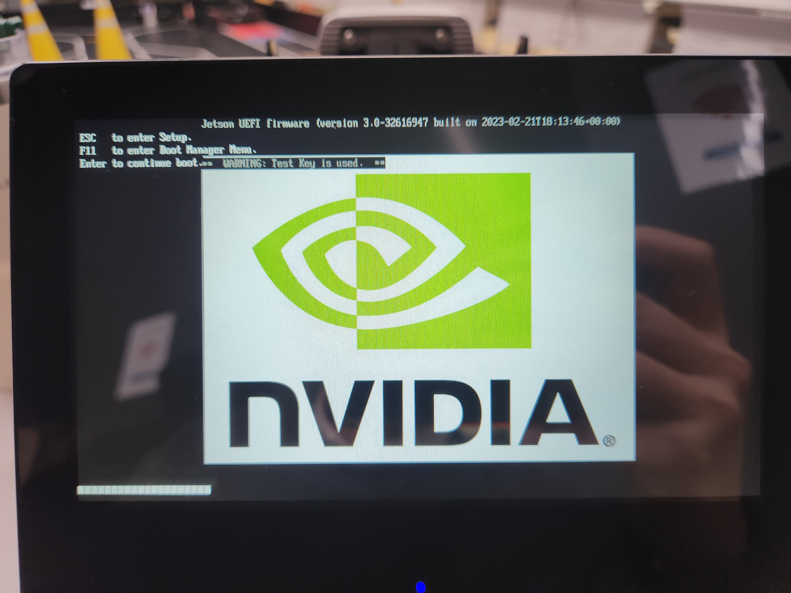

### NVIDIA 로고 이후 검은 화면이 나오고 아예 화면이 나오지 않음

### Nomachine / ssh 접속 안됨  
### SD 카드로 접속이 실패하여 와이파이 connect 실패

---

# [2] SD 카드 데이터 백업 방법

1. 키보드, 마우스 LIMO Pro USB 단자에 연결

2. 아래 화면에서 F11 연타 후 boot manager 접속


3. 부팅 순서 변경(2번째 KINGBANK KP230 ~ 선택 후 부팅)


4. 좌측 SD 카드 선택

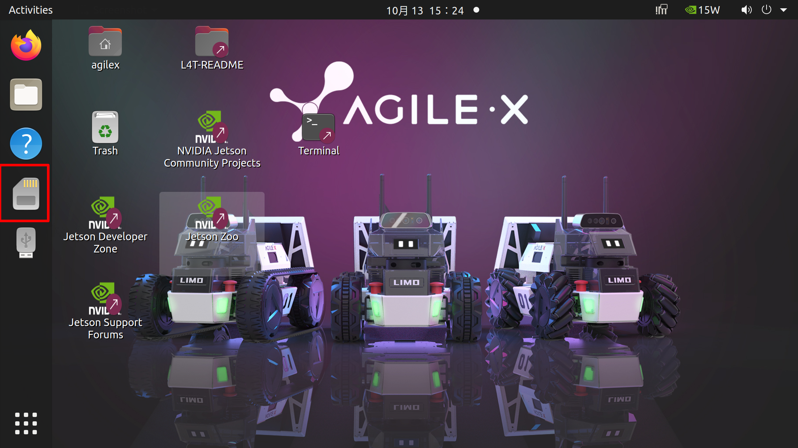

5. 자신의 작업 폴더 백업(home/ros1/catkin_ws/src) - 본인이 작업한 패키지

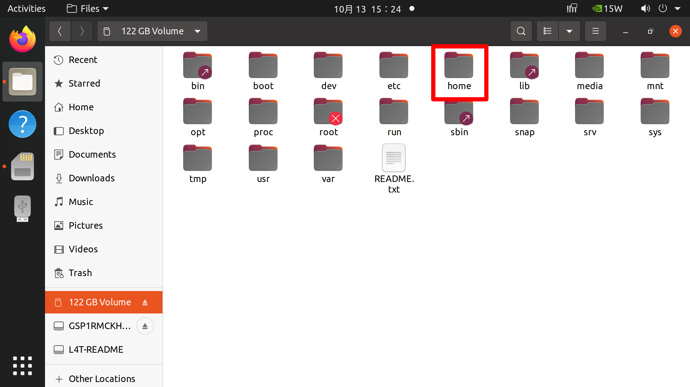

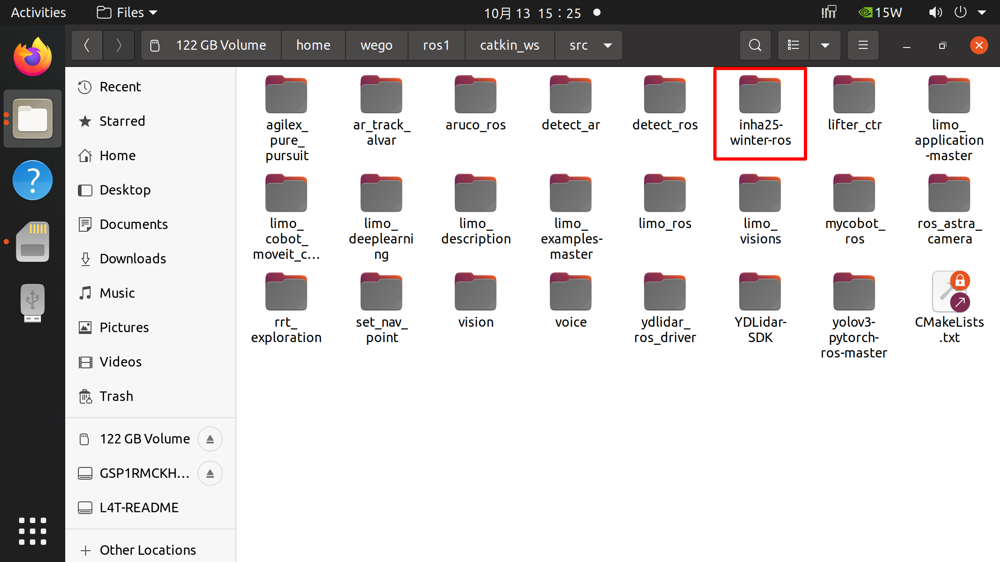

---

# [3] SD 카드 분리


1. LIMO Pro 메뉴얼 중 "Limo 이미지 버전 및 업데이트" 진입

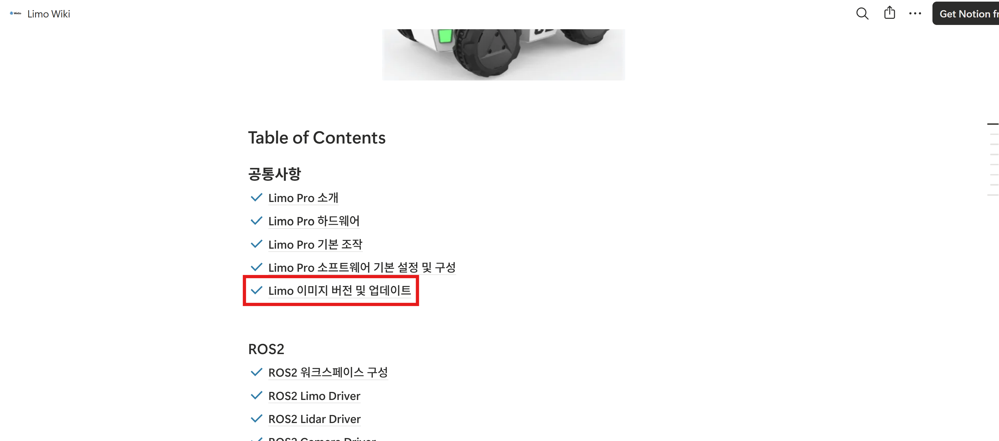

2. 나와있는 분리 방법으로 분해 후 SD 카드 분리

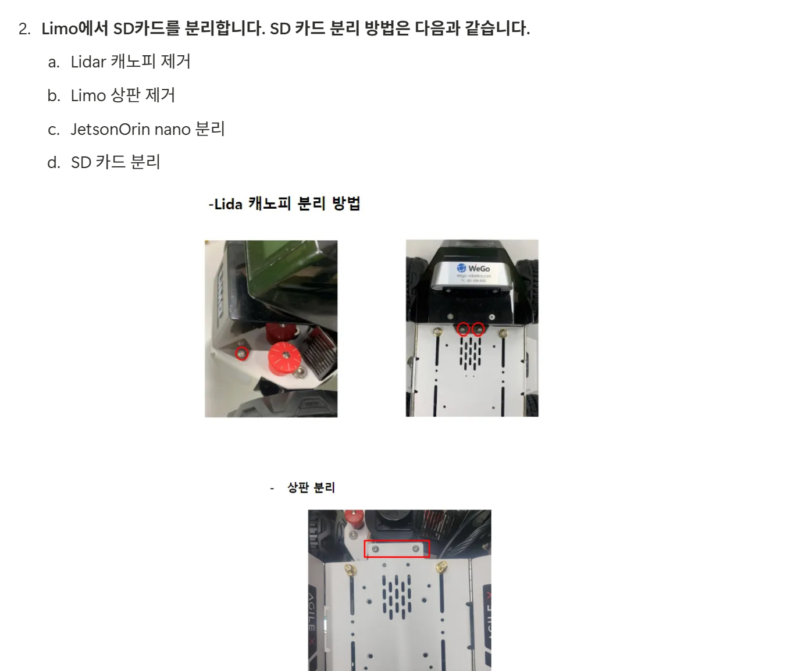

3. SD 카드 이미지 다운(limo_image_1_0_4.img.gz)

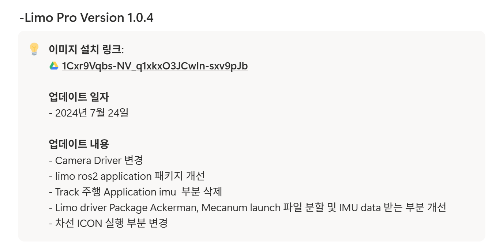

---

# [4] SD 카드 이미지 굽기

1. 나와있는 이미지 덮어씌우기 방식으로 SD 카드 이미지 굽기

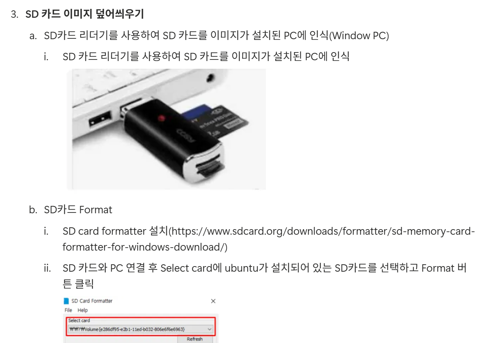

2. 분해 순서 역순으로 재조립 후 똑같이 사용


# [5] ROS1 의존성 빌드

1. ~/.bashrc 진입

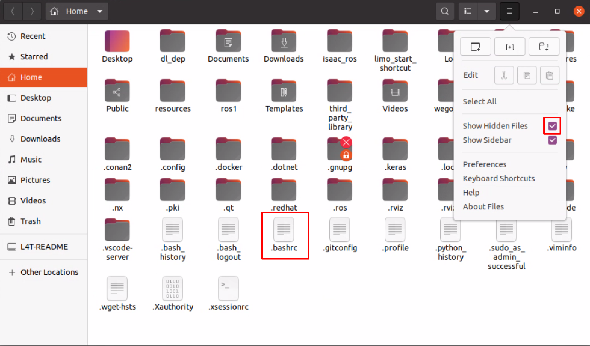

2. ~/.bashrc 아래쪽 ros2 관련 부분 주석 처리

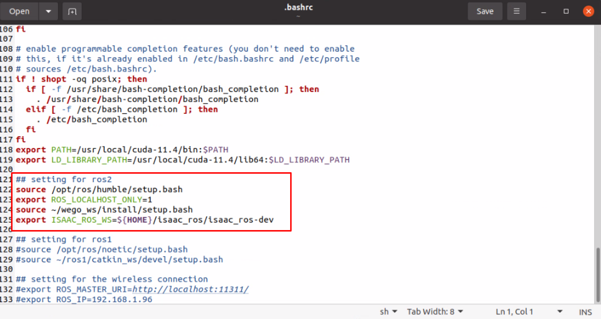

3. ros1 관련 부분 주석 해제

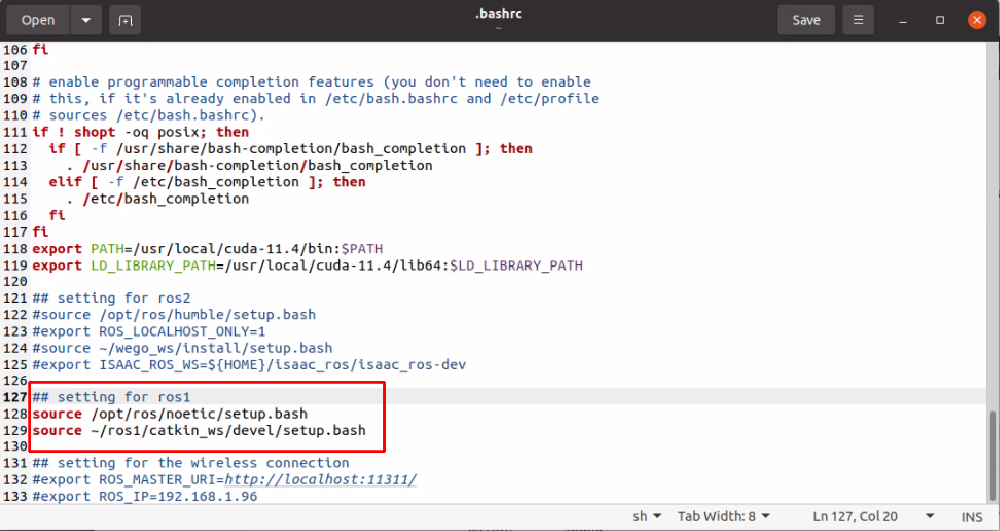

4. 빌드 진행
```shell
source ~/.bashrc
```